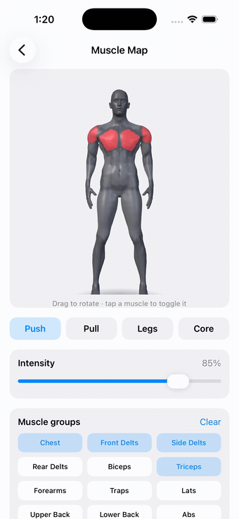

# MuscleMapKit

An interactive 3D muscle map for iOS. Hand it a set of muscles and how hard
each was worked, and it renders a body that shades those muscles, spins under
your finger, and reports taps back by muscle group.

<p align="center">
  
</p>

Built for [Cinder](https://apps.apple.com/app/id6754781687), where it answers
the question you actually have after a session: not *did I train*, but *what
did I actually hit*.

## Install

```swift
.package(url: "https://github.com/haplollc/MuscleMapKit.git", from: "1.0.0")
```

```swift
.target(name: "YourApp", dependencies: ["MuscleMapKit"])
```

Requires iOS 17+.

## Use it

```swift
import MuscleMapKit

MuscleBody3DView(
    intensities: [.chest: 1.0, .frontDelts: 0.6, .triceps: 0.45]
)
.frame(height: 380)
```

`intensities` is `[MuscleGroup: Double]` in `0…1`. Anything you leave out
renders untrained, so you only pass what was worked.

### Reacting to taps

```swift
MuscleBody3DView(
    intensities: intensities,
    onTapMuscle: { muscle in
        print("tapped \(muscle.displayName)")
    }
)
```

### Inside a scrolling list

Gestures are opt-out, because a body that spins under your finger will fight
a `ScrollView` for the same drag:

```swift
MuscleBody3DView(
    intensities: intensities,
    autoRotate: false,
    interactive: false,        // let the scroll view win
    initialYaw: .pi / 5        // rest at a 3/4 angle
)
```

## Turning exercises into muscles

`ExerciseMuscleMap` maps exercise names to the muscles they work, so you can
go straight from a logged workout to a shaded body:

```swift
let result = ExerciseMuscleMap.workoutIntensities(
    exercises: [("Bench Press", 4), ("Squat", 5), ("Barbell Row", 3)]
)

MuscleBody3DView(intensities: result.intensities)
```

Volume drives the shading: more sets on a muscle means a stronger tint.

Names are matched loosely, so `"bench press"`, `"Bench Press"` and
`"  BENCH   PRESS "` all resolve to the same thing.

### Exercises it doesn't know

The table is deliberately finite, and it tells you what it couldn't place
rather than guessing:

```swift
let result = ExerciseMuscleMap.workoutIntensities(
    exercises: [("Bench Press", 4), ("Zercher Good Morning", 3)]
)

result.unresolved   // ["Zercher Good Morning"]
```

Resolve those however you like — a prompt, your own table, a model — and pass
them back in:

```swift
ExerciseMuscleMap.workoutIntensities(
    exercises: exercises,
    resolved: ["Zercher Good Morning": [.hamstrings: 1.0, .lowerBack: 0.7]]
)
```

In Cinder this fallback is a local LLM that classifies unknown names in one
batched call and caches the answer forever. That model isn't part of this
package — the hook is, so you can plug in whatever you already have.

## Muscle groups

Seventeen, in gym vocabulary rather than medical nomenclature, because that's
how lifters log:

`chest` · `frontDelts` · `sideDelts` · `rearDelts` · `biceps` · `triceps`
`forearms` · `traps` · `lats` · `upperBack` · `lowerBack` · `abs` · `obliques`
`glutes` · `quads` · `hamstrings` · `calves`

Every case has a `displayName` fit for a label.

## How the body is made

It's one continuous mesh, not seventeen separate props.

The [MakeHuman](http://www.makehumancommunity.org/) base mesh (CC0) is morphed
toward an athletic build, normalized to a fixed height and orientation, and
then every vertex is classified into one of the seventeen groups using
limb-axis frames. That gets baked to a compact binary blob — position, normal,
muscle id, and a blend weight per vertex — which ships in the package.

At runtime SceneKit tints by muscle id. Recoloring swaps a vertex-color source
and nothing else, so switching muscles costs no geometry work.

Two consequences worth knowing:

- The order of `MuscleGroup.allCases` **is** the mesh's id order. Reordering
  the enum silently repaints the body onto the wrong muscles.
- Blend weights soften the seams, so neighbouring groups fade into each other
  instead of ending at a hard edge.

`Tools/bake_body.py` is the baker, kept in the repo so the mesh is
reproducible rather than a mystery binary.

## Demo

The showcase in the screenshot lives in
[HaploUI](https://github.com/haplollc/HaploUI) under **Muscle Map** — presets,
an intensity slider, and a toggle per group.

## License

MIT for the code. The bundled mesh derives from MakeHuman's CC0 base mesh; see
[LICENSE](LICENSE).
